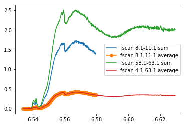
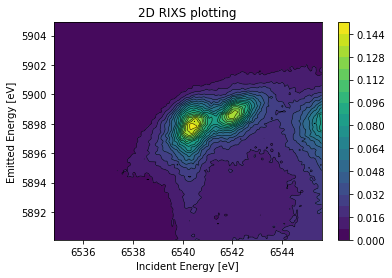
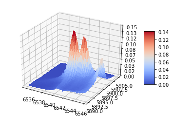
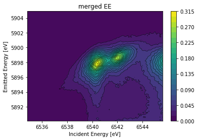
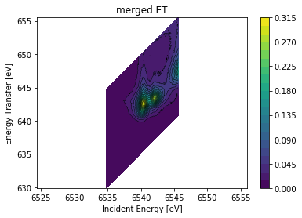
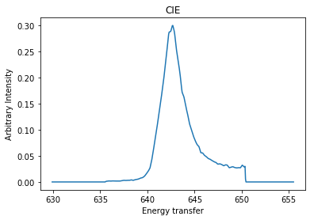
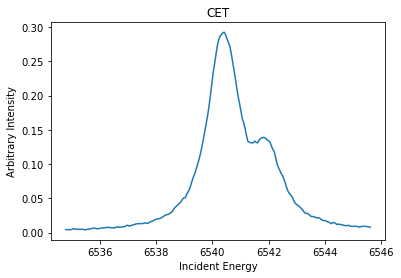
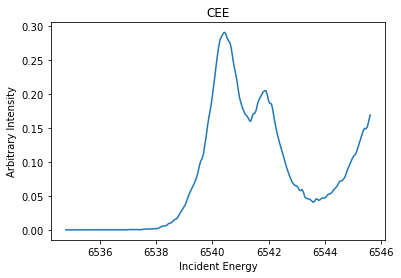
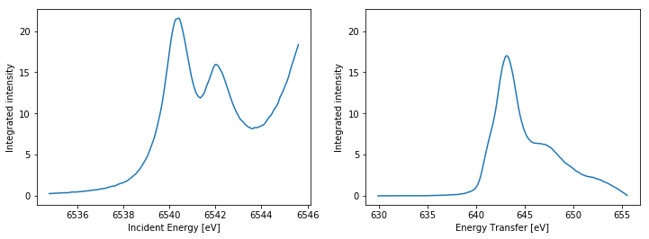

# A simple documentation for RIXS DataAnalysis
Juanjuan Huang (Cathy)<br>
19-04-2017<br>
Version 0.0

## <font color="7d020c">Class DataAnalysis(object)</font>
   <p style="font-size:15px">This includes:</p>
   <p style="font-size:15px"> 1. Averaged/summed XANES plotting with interpolation for incident energy</p> 
   <p style="font-size:15px"> 2. 2D/3D RIXS plane plotting with interpolation for both incident energy and emission energy<br>
   &nbsp; &nbsp;&nbsp; &nbsp;&nbsp; &nbsp;&nbsp; &nbsp;2.1 concentration correction<br>
   &nbsp; &nbsp;&nbsp; &nbsp;&nbsp; &nbsp;&nbsp; &nbsp;2.2 IE versus EE plotting<br>
   &nbsp; &nbsp;&nbsp; &nbsp;&nbsp; &nbsp;&nbsp; &nbsp;2.3 IE versus ET plotting<br> 
   &nbsp; &nbsp;&nbsp; &nbsp;&nbsp; &nbsp;&nbsp; &nbsp;2.4 RIXS plane CIE CEE CET cuts and integration plotting</p>
   <p style="font-size:15px"> 3. Averaging and merging for RIXS planes</p> 
   <p style="font-size:15px"> 4. Save the data into RIXS txt files so that can be further used by other software, e.g, Matlab</p>  

  ### Methods
  <b>XANES_data( ): </b>To get XANES merged data ndarray from SPEC file<br>
      return 1d ndarray [incident energy, intensity]

  <b>RIXS_data( ) :</b>To get RIXS data ndarray from SPEC file<br> 
      return data ndarray [incident energy, emission energy, intensity]

  <b>RIXS_merge( ): </b>To merge (sum up/average different RIXS data ndarray)<br>
      return data ndarray [incident energy, emission energy, intensity]

  <b>RIXS_display( ) :</b>To plot RIXS planes<br>
      return None

  <b>RIXS_cut( ) :</b>To do CIE, CET, CEE cuts<br>
      return CIE, CET, CEE data ndarray [incident energy/energy transfer, intensity]

  <b>RIXS_integration( ) :</b>Integration along incident energy and energy transfer<br>
      return integrated data ndarray [incident energy/energy transfer, intensity]

  ### Parameters
  path : the filepath of Specfile

### <font color="7d020c">Example</font>   |   Initialization


```python
from DataAnalysiscopy import DataAnalysis
import matplotlib.pyplot as plt
```


```python
mycompound = DataAnalysis('/Users/brookcathy/Desktop/Experiments/Compound_7')
```

-------------------------------
## <font color="890553"> I. XANES_data()</font>

To get XANES merged data ndarray from SPEC file
The incident energy for scans can be different

### Parameters
<b>firstScan</b> : the index of first scan, e.g, 71 corresponding to fscan '72.1'<br>
<b>lastScan</b> : the index of first scan<br>
<b>interp_npt_1eV</b> : the number of interpolation points for 1 eV,<br> 
&nbsp; &nbsp;&nbsp; &nbsp;&nbsp; &nbsp;&nbsp; &nbsp;&nbsp; &nbsp;&nbsp; &nbsp;&nbsp; &nbsp; &nbsp;&nbsp; &nbsp;&nbsp; default: 20 points for 1 eV<br>
&nbsp; &nbsp;&nbsp; &nbsp;&nbsp; &nbsp;&nbsp; &nbsp;&nbsp; &nbsp;&nbsp; &nbsp;&nbsp;&nbsp;&nbsp; &nbsp; &nbsp;&nbsp; &nbsp;e.g, Incident Energy: 6535 eV - 6545 eV, 11 eV,115 points, -----> 220 points<br>
<b>method</b> : 'average' or 'sum' for intensity<br>
<b>savetxt</b>: default True, save the ET, EE data as folders<br>
### Returns
<b>out</b> : &nbsp; &nbsp;&nbsp;A 1d data ndarray [incident_Energy_interp, XANES_merge_inten]<br>
&nbsp; &nbsp;&nbsp; &nbsp;&nbsp; &nbsp;&nbsp; &nbsp;incident_Energy_interp -----> interpolated incident energy<br>
&nbsp; &nbsp;&nbsp; &nbsp;&nbsp; &nbsp;&nbsp; &nbsp;XANES_merge_inten -----> interpolated intensity<br>

### <font color="7d020c">Example</font>   |   XANES_data()


```python
energy1, intensity1 = mycompound.XANES_data(7,10, method = 'sum')
energy2, intensity2 = mycompound.XANES_data(7,10, method = 'average')
# or we can use one variable
myXANES3 = mycompound.XANES_data(57,62, method = 'sum')
myXANES4 = mycompound.XANES_data(3,62, method = 'average')
fig = plt.figure(1)
plot1 = plt.plot(energy1,intensity1,
                 energy2,intensity2,'-o',
                 myXANES3[0],myXANES3[1],
                 myXANES4[0],myXANES4[1])
plt.legend(['fscan 8.1-11.1 sum','fscan 8.1-11.1 average','fscan 58.1-63.1 sum','fscan 4.1-63.1 average'])
plt.show()
```





-------------------------------
## <font color="890553"> II. RIXS_data()</font>

RIXS_data(self,firstScan, lastScan, concCorrecScan, interp_npt_1eV = 20, choice = 'EE', savetxt = False)

To get RIXS data ndarray from SPEC file

### Parameters
<b>firstScan</b> : the index of first scan, e.g, 71 corresponding to fscan '72.1'<br>
<b>lastScan</b> : the index of first scan<br>
<b>concCorrecScan</b> : the index of concentration correction scan, normally the one after last RIXS scan<br>
<b>interp_npt_1eV</b> : the number of interpolation points for 1 eV, default: 20 points for 1 eV<br>
                 &nbsp;&nbsp; &nbsp;&nbsp; &nbsp;&nbsp; &nbsp;&nbsp; &nbsp;&nbsp; &nbsp;&nbsp; &nbsp;&nbsp; &nbsp; &nbsp;&nbsp; &nbsp;&nbsp;e.g, Incident Energy: 6535 eV - 6545 eV, 11 eV, 115 points, -----> 220 points<br>
                       &nbsp;&nbsp; &nbsp;&nbsp; &nbsp;&nbsp; &nbsp;&nbsp; &nbsp;&nbsp; &nbsp;&nbsp; &nbsp;&nbsp; &nbsp; &nbsp;&nbsp; &nbsp;&nbsp;Emitted  Energy: 5890 eV - 5905 eV, 15 eV, 76  points, -----> 300 points<br>
<b>choice</b> : 'EE': get -----> incident energy & emission energy plotting<br>
         &nbsp;&nbsp;&nbsp; &nbsp;&nbsp; &nbsp; &nbsp;&nbsp; &nbsp;&nbsp;'ET': get -----> energy transfer & emission energy plotting<br>
<b>savetxt</b>: default True, save the ET, EE data as folders <br>

### Returns
if choice = 'EE'<br>
<b>out</b> : ndarray, A data list [EE_XX, EE_YY, EE_MDfci_correc_inten_2dinterp]<br>
      EE_XX -----> interpolated incident energy ndarray<br>
      EE_YY -----> interpolated emission energy ndarray<br>
      EE_MDfci_correc_inten_2dinterp -----> interpolated intensity ndarray<br>

if choice = 'ET'<br>
<b>out</b> : ndarray, A data list [ET_XX, ET_YY, ET_MDfci_correc_inten_2dinterp]<br>
      ET_XX -----> interpolated incident energy ndarray<br>
      ET_YY -----> interpolated energy transfer ndarray<br>
      ET_MDfci_correc_inten_2dinterp -----> interpolated intensity ndarray

### <font color="7d020c">Example</font>   |   RIXS_data()


```python
# Get incident energy - emitted energy RIXS planes
my_RIXS_scan1_EE = mycompound.RIXS_data(71, 146, 147, choice = 'EE')
print('my_RIXS_scan1_EE[0] is incident energy ndarray\n', 
       my_RIXS_scan1_EE[0])
print('\nmy_RIXS_scan1_EE[1] is emitted energy ndarray\n', 
       my_RIXS_scan1_EE[1])
print('\nmy_RIXS_scan1_EE[2] is intensity ndarray\n', 
       my_RIXS_scan1_EE[2])

# Get incident energy - energy transfer RIXS planes
my_RIXS_scan1_ET = compound7.RIXS_data(71, 146, 147, choice = 'ET')
```

    my_RIXS_scan1_EE[0] is incident energy ndarray
     [[ 6.5348      6.53484932  6.53489863 ...,  6.54550137  6.54555068  6.5456    ]
     [ 6.5348      6.53484932  6.53489863 ...,  6.54550137  6.54555068  6.5456    ]
     [ 6.5348      6.53484932  6.53489863 ...,  6.54550137  6.54555068  6.5456    ]
     ..., 
     [ 6.5348      6.53484932  6.53489863 ...,  6.54550137  6.54555068  6.5456    ]
     [ 6.5348      6.53484932  6.53489863 ...,  6.54550137  6.54555068  6.5456    ]
     [ 6.5348      6.53484932  6.53489863 ...,  6.54550137  6.54555068  6.5456    ]]
    
    my_RIXS_scan1_EE[1] is emitted energy ndarray
     [[ 5.8901     5.8901     5.8901    ...,  5.8901     5.8901     5.8901   ]
     [ 5.8901495  5.8901495  5.8901495 ...,  5.8901495  5.8901495  5.8901495]
     [ 5.890199   5.890199   5.890199  ...,  5.890199   5.890199   5.890199 ]
     ..., 
     [ 5.904801   5.904801   5.904801  ...,  5.904801   5.904801   5.904801 ]
     [ 5.9048505  5.9048505  5.9048505 ...,  5.9048505  5.9048505  5.9048505]
     [ 5.9049     5.9049     5.9049    ...,  5.9049     5.9049     5.9049   ]]
    
    my_RIXS_scan1_EE[2] is intensity ndarray
     [[  7.73266826e-04   7.53737365e-04   9.19551102e-04 ...,   2.24629582e-02
        2.24481190e-02   2.27046391e-02]
     [  6.60401048e-04   7.04537648e-04   9.23681323e-04 ...,   2.26024654e-02
        2.24696364e-02   2.26298456e-02]
     [  5.47535271e-04   6.55337930e-04   9.27811544e-04 ...,   2.27419727e-02
        2.24911538e-02   2.25550522e-02]
     ..., 
     [  0.00000000e+00   4.20772534e-05   1.00669336e-04 ...,   1.05678532e-03
        1.23209819e-03   1.43534646e-03]
     [  0.00000000e+00   3.16214871e-05   7.56540378e-05 ...,   1.07657088e-03
        1.16958215e-03   1.31468426e-03]
     [  0.00000000e+00   2.11657208e-05   5.06387393e-05 ...,   1.09635645e-03
        1.10706611e-03   1.19402207e-03]]


--------------------------
## <font color="890553"> III. RIXS_display()</font>

To plot RIXS planes

### Parameters
<b>dataArray</b>: the return ndarray [XX, YY, intensity] from RIXS_data<br>
<b>title</b>: plotting title, str<br>
<b>choice</b>: 'EE' emission energy(default) or 'ET' energy transfer<br>
<b>mode</b>: '2d' 2D plotting(default), '3d' 3D plotting<br>

### Returns
out : plt.figure

### <font color="7d020c">Example</font>   | RIXS_display()


```python
mycompound.RIXS_display(my_RIXS_scan1_EE, title = '2D RIXS plotting', choice = 'EE',mode = '2d')
mycompound.RIXS_display(my_RIXS_scan1_EE, title = '3D RIXS plotting', choice = 'EE',mode = '3d')
```








-------------------------------
## <font color="890553"> IV. RIXS_merge ()</font>

To merge (sum up/average different RIXS data ndarray)

### Parameters
<b>scansets</b> : put all the RIXS_data output file that want to mergy into a list<br>
           e.g. [dataArray1, dataArray2, dataArray3]<br>
<b>choice</b> : 'sum':     get -----> summed intensity<br>
         'average': get -----> averaged intensity<br>

### Returns
if choice = 'sum':<br>
<b>out</b> : A new ndarray dataArray with summed intensity<br> 
      -----> [averaged_XX,averaged_YY,summed_intensity]<br>

if choice = 'average':<br>
<b>out</b> : A new ndarray dataArray with summed intensity<br>
      -----> [averaged_XX,averaged_YY,averaged_intensity]<br>

### <font color="7d020c">Example</font>   |   RIXS_merge()


```python
my_RIXS_scan2_EE = mycompound.RIXS_data(151, 226, 227, choice = 'EE')
my_RIXS_scan2_ET = mycompound.RIXS_data(151, 226, 227, choice = 'ET')  

my_merged_RIXS_EE = mycompound.RIXS_merge([my_RIXS_scan1_EE, my_RIXS_scan2_EE])
my_merged_RIXS_ET = mycompound.RIXS_merge([my_RIXS_scan1_ET, my_RIXS_scan2_ET])
mycompound.RIXS_display(my_merged_RIXS_EE, choice='EE', title ='merged EE')
mycompound.RIXS_display(my_merged_RIXS_ET, choice='ET', title ='merged ET')
```








--------------------------
## <font color="890553"> V. RIXS_cut()</font>

To do CIE, CET, CEE cuts(choice, cut)<br>
NOTICE: Choose ET dataArray for CIE & CET<br>
        Choose EE dataArray for CEE<br>

### Parameters
<b>dataArray</b>: the RIXS_data output file<br>
<b>choice</b>: 'CIE'-- Constant incident energy cut<br>
        'CET'-- Constant energy transfer cut<br>
        'CEE'-- Constant emission energy cut<br>
<b>cut</b>: the energy (eV) you want to cut, e.g., 6530 eV<br>

### Returns
<b>out</b> : 
ndarray<br>
CIE, CET, CEE data ndarray [incident energy/energy transfer, intensity]

### <font color="7d020c">Example</font>   |    RIXS_cut()


```python
mycompound.RIXS_cut(my_merged_RIXS_ET,'CIE',6540.48);
mycompound.RIXS_cut(my_merged_RIXS_ET,'CET',642.45);
mycompound.RIXS_cut(my_merged_RIXS_EE,'CEE',5898);
```











--------------------------
## <font color="890553"> VI.RIXS_integration()</font>

Integration along incident energy and energy transfer

Parameters
----------
<b>dataArray</b>: the RIXS_data return data ndarray

Returns
-------
<b>out</b> :     
ndarray<br>
integrated data ndarray [incident energy/energy transfer, intensity]

### <font color="7d020c">Example</font>   |    RIXS_integration()


```python
mycompound.RIXS_integration(my_merged_RIXS_ET);
```




